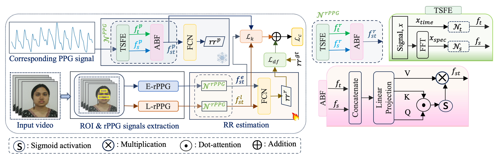

# DIL-RR
DIL-RR is a dataset for contactless respiration rate estimation from facial videos. It contains synchronized RGB face videos, contact PPG signals, and ground-truth respiration signals collected in a controlled indoor environment. 

## Highlights
- 119 subjects
- 90-second recordings
- RGB face video + synchronized PPG + ground-truth RR
- 640x480 resolution at 30 fps
- Suitable for rPPG-based respiration estimation research

## Dataset Statistics
- Subjects: 119
- Male/Female: 93 / 26
- Age range: 18-40 years
- Recording duration: 90 seconds

## License

Please note that this dataset could be used for research purposes only, and any commercial use of the data is prohibited. To access this dataset, fill [this agreement](https://drive.google.com/file/d/1zOdOxvSjEcPWkUADgKKt5o7Du3laZJlW/view?usp=sharing) and send to the following email addresses:

* phd2201101014@iiti.ac.in
* deeplearning@iiti.ac.in

## Baseline: PulseGuide-RR

To support benchmarking on DIL-RR, we provide the baseline method **PulseGuide-RR**, proposed in our FG 2026 paper. PulseGuide-RR is a contactless respiration rate estimation framework that learns from facial video while being guided by synchronized contact PPG signals during training. The goal is to improve rPPG-based respiration estimation by transferring rich respiration-related knowledge from PPG to rPPG.

  

### Overview

PulseGuide-RR first detects facial regions of interest (ROIs) from the input video and extracts two complementary remote physiological signals:

- **Eulerian rPPG (E-rPPG):** derived from subtle skin color changes
- **Lagrangian rPPG (L-rPPG):** derived from subtle facial motion

These two signals are processed independently through a temporal-spectral feature extraction network. In parallel, the corresponding contact PPG signal is passed through a frozen PPG branch to extract respiration-related temporal-spectral features. During training, the PPG branch guides the rPPG branches through a knowledge distillation objective so that the video-based model can learn stronger respiration-relevant representations.

Within each modality, temporal and spectral features are fused using an attention-based fusion block. The resulting Eulerian and Lagrangian representations are then combined to estimate the final respiration rate.

### Key components

- **ROI extraction** from facial video
- **Dual rPPG pathway:** Eulerian and Lagrangian signals
- **Temporal-spectral feature extraction**
- **Attention-based fusion**
- **PPG-guided knowledge distillation**
- **Final respiration rate estimation**

### Training setting

The baseline is trained using synchronized facial video, PPG, and ground-truth respiration signals. However, at inference time, the model only requires the facial video, making it a fully contactless RR estimation method.

### Evaluation

In our paper, performance is reported using:

- **MAE** (Mean Absolute Error)
- **RMSE** (Root Mean Squared Error)
- **Pearson correlation coefficient (r)**

The subject split used in the paper is **80% training, 10% validation, and 10% testing**.

For full implementation details, training strategy, and experimental settings, please refer to our paper.

## Citation

Please cite the following paper if this dataset helps your research:

    @article{saikia2026dilrr,
      title={Exploring PPG-Guided Knowledge Distillation for Contactless Respiration Estimation},
      author={Saikia, Trishna and Gupta, Anup Kumar and Gupta, Puneet, Liljeberg, Pasi},
      journal={IEEE international conference on automatic face & gesture recognition (FG)},
      year={2026},
      publisher={IEEE}
    }
